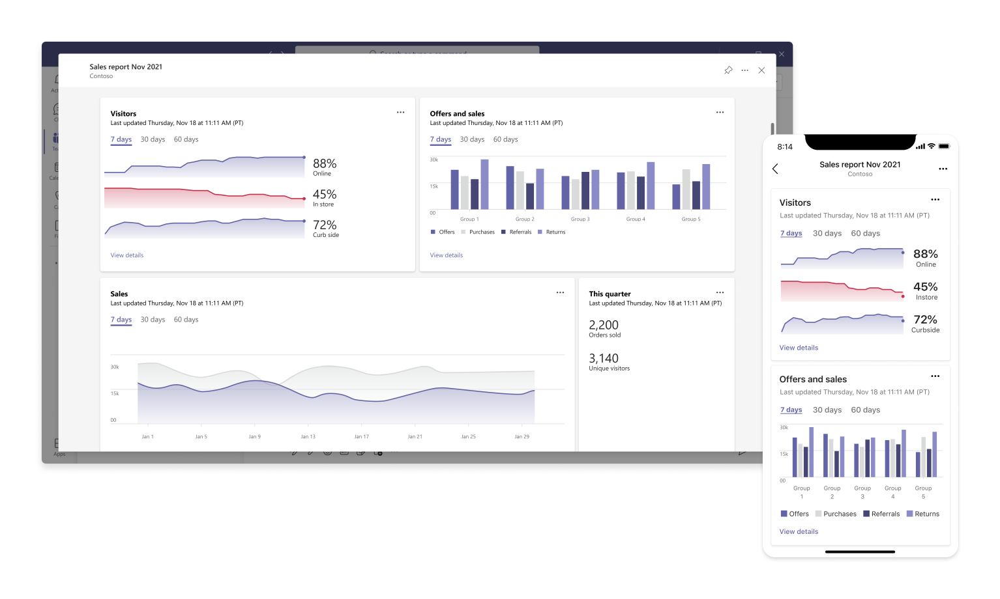
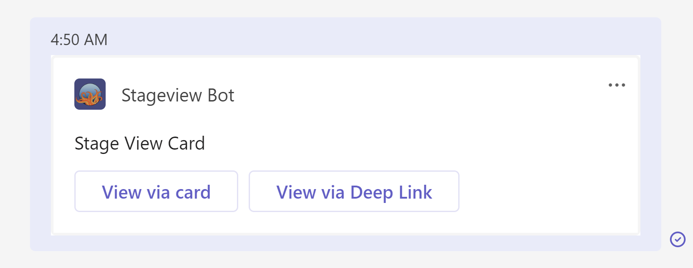

# Stageview ME bot

[Messaging Extensions](https://docs.microsoft.com/en-us/microsoftteams/platform/messaging-extensions/what-are-messaging-extensions) are a special kind of Microsoft Teams application that is supported by the [Bot Framework](https://dev.botframework.com) v4.

There are two basic types of Messaging Extension in Teams: [Search-based](https://docs.microsoft.com/en-us/microsoftteams/platform/messaging-extensions/how-to/search-commands/define-search-command) and [Action-based](https://docs.microsoft.com/en-us/microsoftteams/platform/messaging-extensions/how-to/action-commands/define-action-command). This sample illustrates how to build a Action-based ME that support opening up of a stageview from an adaptive card or a deeplink url.

## Stageview UI

Stage View is a full screen UI component that you can invoke to surface your web content. The existing link unfurling service is updated so that it's used to turn URLs into a tab using an Adaptive Card and Chat Services. When a user sends a URL in a chat or channel, the URL is unfurled to an Adaptive Card. The user can select View in the card, and pin the content as a tab directly from Stage View. Refer [Docs](https://docs.microsoft.com/en-us/microsoftteams/platform/tabs/tabs-link-unfurling)



### Bot Capabilities

This bot enables us to invoke a stageview from an adaptive card ora deeplinkUrl action.


## Prerequisites

- Microsoft Teams is installed and you have an account
- [NodeJS](https://nodejs.org/en/) version 10.14.1 or higher
- [ngrok](https://ngrok.com/) or equivalent tunnelling solution

  ```bash
  # determine node version
  node --version
  ```

## To run the bot

> Note these instructions are for running the sample on your local machine, the tunnelling solution is required because
> the Teams service needs to call into the bot.

1. Clone the repository

   ```bash
   git clone https://github.com/ashwinvc/stageview-bot.git
   ```

1. Install modules

   ```bash
   npm install
   ```

1. Run ngrok - point to port 3978

   ```bash
   ngrok http -host-header=rewrite 3978
   ```

1. Create [Bot Framework registration resource](https://docs.microsoft.com/en-us/azure/bot-service/bot-service-quickstart-registration) in Azure

   - Use the current `https` URL you were given by running ngrok. Append with the path `/api/messages` used by this sample
   - Ensure that you've [enabled the Teams Channel](https://docs.microsoft.com/en-us/azure/bot-service/channel-connect-teams?view=azure-bot-service-4.0)
   - **_If you don't have an Azure account_** you can use this [Bot Framework registration](https://docs.microsoft.com/en-us/microsoftteams/platform/bots/how-to/create-a-bot-for-teams#register-your-web-service-with-the-bot-framework)

1. Update the `.env` configuration for the bot to use the Microsoft App Id and App Password from the Bot Framework registration. (Note the App Password is referred to as the "client secret" in the azure portal and you can always create a new client secret anytime.)

1. **_This step is specific to Teams._**

   - **Edit** the `manifest.json` contained in the `teamsAppManifest` folder to replace your Microsoft App Id (that was created when you registered your bot earlier) _everywhere_ you see the place holder string `<<YOUR-MICROSOFT-APP-ID>>` (depending on the scenario the Microsoft App Id may occur multiple times in the `manifest.json`)
   - **Zip** up the contents of the `teamsAppManifest` folder to create a `manifest.zip`
   - **Upload** the `manifest.zip` to Teams (in the Apps view click "Upload a custom app")

1. Run your bot at the command line:

   ```bash
   npm start
   ```

## Interacting with the bot

> Note this `manifest.json` specified that the feature will be available from both the `compose` and `commandBox` areas of Teams. Please refer to Teams documentation for more details.
> In Teams, the command bar is located at the top of the window. When you at mention the bot what you type is forwarded (as you type) to the bot for processing. By way of illustration, this sample uses the text it receives to query the npmjs package store.

There is a secondary, drill down, event illustrated in this sample: clicking on the results from the initial query will result in the bot receiving another event.

## Deploy the bot to Azure

### Publishing Changes to Azure Bot Service

    ```bash
    # build the TypeScript bot before you publish
    npm run build
    ```

To learn more about deploying a bot to Azure, see [Deploy your bot to Azure](https://aka.ms/azuredeployment) for a complete list of deployment instructions.

## Further reading

- [How Microsoft Teams bots work](https://docs.microsoft.com/en-us/azure/bot-service/bot-builder-basics-teams?view=azure-bot-service-4.0&tabs=javascript)
- [Bot Framework Documentation](https://docs.botframework.com)
- [Bot Basics](https://docs.microsoft.com/azure/bot-service/bot-builder-basics?view=azure-bot-service-4.0)
- [Dialogs](https://docs.microsoft.com/en-us/azure/bot-service/bot-builder-concept-dialog?view=azure-bot-service-4.0)
- [Gathering Input Using Prompts](https://docs.microsoft.com/en-us/azure/bot-service/bot-builder-prompts?view=azure-bot-service-4.0)
- [Activity processing](https://docs.microsoft.com/en-us/azure/bot-service/bot-builder-concept-activity-processing?view=azure-bot-service-4.0)
- [Azure Bot Service Introduction](https://docs.microsoft.com/azure/bot-service/bot-service-overview-introduction?view=azure-bot-service-4.0)
- [Azure Bot Service Documentation](https://docs.microsoft.com/azure/bot-service/?view=azure-bot-service-4.0)
- [Azure CLI](https://docs.microsoft.com/cli/azure/?view=azure-cli-latest)
- [Azure Portal](https://portal.azure.com)
- [Language Understanding using LUIS](https://docs.microsoft.com/en-us/azure/cognitive-services/luis/)
- [Channels and Bot Connector Service](https://docs.microsoft.com/en-us/azure/bot-service/bot-concepts?view=azure-bot-service-4.0)
- [TypeScript](https://www.typescriptlang.org)
- [Restify](https://www.npmjs.com/package/restify)
- [dotenv](https://www.npmjs.com/package/dotenv)
